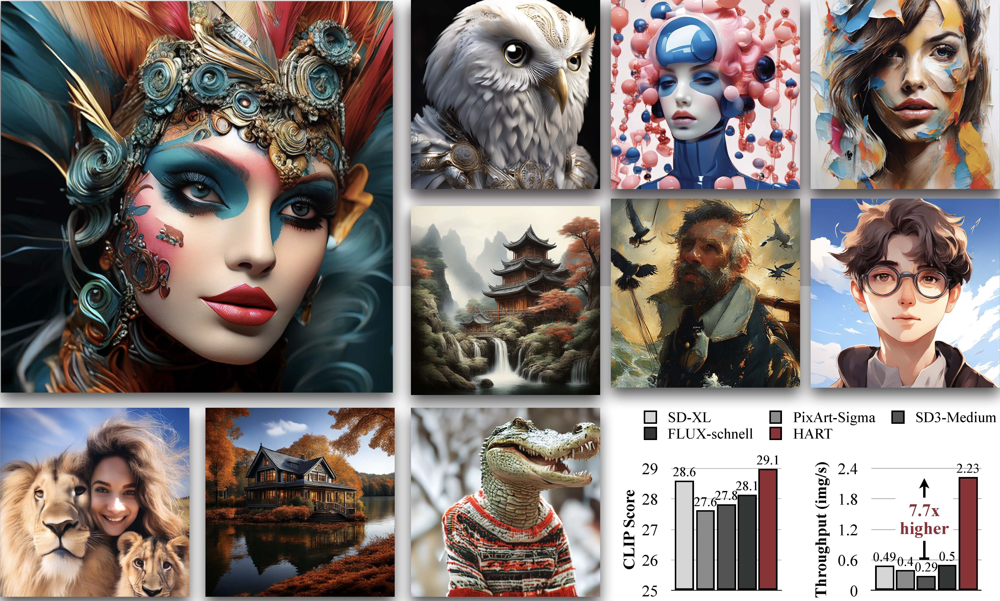

# Hybrid Autoregressive Transformer (HART) on ARM

\[[Paper](https://arxiv.org/abs/2410.10812)\] \[[Demo](https://hart.mit.edu)\] \[[Project](https://hanlab.mit.edu/projects/hart)\]



## Abstract

Existing image generation models require large amounts of resources to generate an image given a text prompt. One of the main bottlenecks is the large amounts of memory required to perform even a single inference. Running existing models on personal computers often leads to an out-of-memory (OOM) failure. Previous works like the Hybrid Autoregressive Transformer (HART) attempts to reduce the resource usage of image generation models, while still rivaling diffusion models in image generation quality. The provided open source implementation deploys HART on laptops with NVIDIA GPUs, but it has not supported model deployment on Macbook GPUs yet. The goal of this project is to deploy and optimize HART on Macbooks using the PyTorch MPS backend and Apple’s MLX framework.

## Setup

Download the repository and make a conda environment:

```bash
git clone https://github.com/dolphingarlic/hart.git
git checkout mps-conversion
cd hart
conda create -n hart python=3.10
conda activate hart
```

For M2/M3 Macs, add this to zshrc:

```bash
export CC=/opt/homebrew/opt/llvm/bin/clang
export CXX=/opt/homebrew/opt/llvm/bin/clang++
```

And activate zshrc:

```bash
source ~/.zshrc
brew install llvm libopenmp
```

Install other packages:

```bash
pip install -e .
cd ..
```

Download the following two repositories outside the HART repository (in the same level as HART).

Download Qwen2-VL-1.5B-Instruct

```bash
git clone https://huggingface.co/mit-han-lab/Qwen2-VL-1.5B-Instruct
```

Download HART tokenizer and models

```bash
git clone https://huggingface.co/mit-han-lab/hart-0.7b-1024px
```

Go into the Qwen and HART tokenizer repos and run:

```bash
git lfs install
git lfs pull
```

To test that everything was installed correctly, run:

```bash
./sample.sh
```

And you should get a crying graduate student!


## Usage

### Gradio demo

You may launch the Gradio demo using the following script:

```bash
python app.py ---model_path /path/to/model \
   --text_model_path /path/to/Qwen2 \
   --shield_model_path /path/to/ShieldGemma2B 
```

Please notice that for model_path, please point it to the `llm` folder under our pretrained checkpoint. For example, if your model is stored at `checkpoints/hart-0.7b-1024px`, then `model_path` should be `checkpoints/hart-0.7b-1024px/llm`. Similar for all commands below.

### Command Line Inference

1. Sampling with single prompt:

```bash
python sample.py --model_path /path/to/model \
   --text_model_path /path/to/Qwen2 \
   --prompt "YOUR_PROMPT" \
   --sample_folder_dir /path/to/save_dir \
   --shield_model_path /path/to/ShieldGemma2B
```

2. Sampling with multiple prompts:

```bash
# You can add --store_separately to store each image individually, otherwise images will be stored in one grid.
python sample.py --model_path /path/to/model \
   --text_model_path /path/to/Qwen2 \
   --prompt_list [Prompt1, Prompt2, ..., PromptN] \
   --sample_folder_dir /path/to/save_dir \
   --shield_model_path /path/to/ShieldGemma2B
```

### Latency Benchmarking

Please use the following prompt to perform latency benchmarking:

```bash
python latency_profile.py --model_path /path/to/model \
   --text_model_path /path/to/Qwen2
```

## Acknowledgements

Thank you Professor Song Han and Teaching Assistant Haotian Tang for providing us the resources for this final project for 6.5940 TinyML and Efficient Deep Learning Computing.

## Citation

```bibtex
@article{tang2024hart,
  title={HART: Efficient Visual Generation with Hybrid Autoregressive Transformer},
  author={Tang, Haotian and Wu, Yecheng and Yang, Shang and Xie, Enze and Chen, Junsong and Chen, Junyu and Zhang, Zhuoyang and Cai, Han and Lu, Yao and Han, Song},
  journal={arXiv preprint},
  year={2024}
}
```
